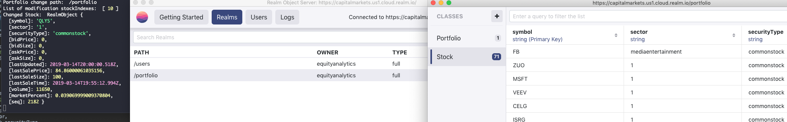

# iex-realm-service
## Integrates IEX to Realm cloud db for the Mobile integration

1. Integrates from IEX to Realm DB cloud solution
2. Cron iteration to get latest news
3. Completed adding Listeners for News & Stock changes - (Documentation could be better  with explanantion ob API & diagrams) (Api for for pics for permissions on classes, realms etc needed)

Realm listener realm.objects('Stock') not able to return any objects. The path does not show the Schema in cloud server. Any help?

