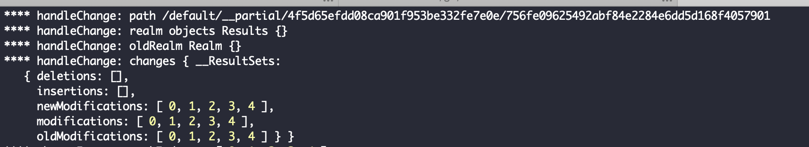
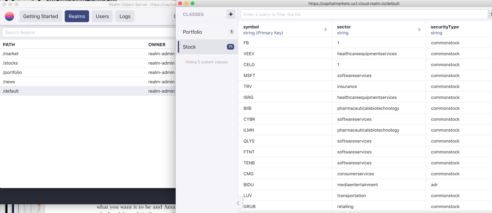

# iex-realm-service
## Integrates IEX to Realm cloud db for the Mobile integration

1. Integrates from IEX to Realm DB cloud solution
2. Cron iteration to get latest news
3. Listener - Documentation needs a better explanantion with pics for permissions on classes, realms etc

#### NOTES
1. I tried to use a realm other than default but not much of a documentation to do this? I am tring to sync data from third party in parallel with information like stock, news, charts etc.
2. I gave a config path at the time of Realm write operation but this does not work.
3. When debugging, paths are uuid based(not sure if that is ok?) but I should be able to get the data from the schema type anyway but failing to as 'NOTIFIER_PATH' cannot match a uuid.
4. Also the realm.object call is able to find the schema but not able to get the object!

Realm listener realm.objects('Stock') not able to return any objects. The path does not show the Schema in cloud server. Any help?

